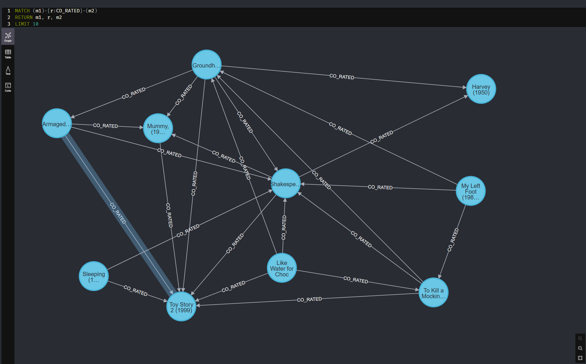
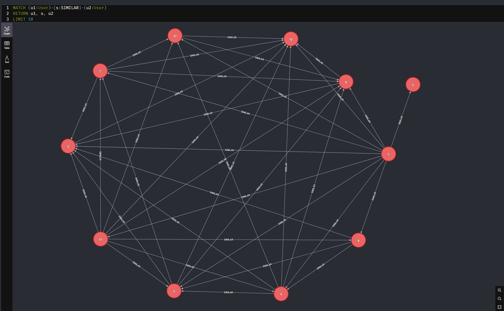

## Частина 1 — проєктування схеми

### Схема графа

```
(User)
| userId: Integer
| gender: String
| age: Integer
| occupation: Integer
```

```
(Movie)
| movieId: Integer
| title: String
| year: Integer
```

```
(Genre)
| name: String
```

```
(User)-[:RATED]->(Movie)
| rating: Integer
| timestamp: Integer
```

```
(Movie)-[:HAS_GENRE]->(Genre)
```

### 1. Які сутності стали вузлами, а які — ребрами? Чому?

Вузлами стали `User`, `Movie` і `Genre`, тому що це основні сутності предметної області, які можуть мати власні властивості та брати участь у багатьох зв'язках. Користувач має демографічні атрибути, фільм має назву й рік випуску, а жанр є окремою категорією, яку можуть мати багато фільмів.

Ребрами стали `RATED` і `HAS_GENRE`. Зв'язок `RATED` показує дію користувача щодо конкретного фільму й містить властивості цієї дії: оцінку та час. Зв'язок `HAS_GENRE` показує належність фільму до жанру. Така модель добре підходить для графових запитів: можна швидко переходити від користувача до переглянутих фільмів, від фільмів до жанрів, а також знаходити схожих користувачів через спільні оцінки.

### 2. Оцінка користувача за фільм — це ребро `(User)-[:RATED]->(Movie)` чи окремий вузол `Rating`?

У цій роботі оцінка моделюється як ребро `(User)-[:RATED]->(Movie)` із властивостями `rating` і `timestamp`. Це природний варіант, бо оцінка є саме взаємодією між двома сутностями — користувачем і фільмом. Такий підхід робить типові запити коротшими: наприклад, пошук фільмів, які користувач оцінив високо, або пошук користувачів зі схожими оцінками виконується прямим обходом ребер.

Окремий вузол `Rating` мав би сенс, якби оцінка була складною сутністю: наприклад, мала коментарій, історію змін, реакції інших користувачів або кілька незалежних зв'язків з іншими сутностями. Недолік такого підходу для нашого датасету — більше вузлів і довші шляхи: замість одного переходу `User -> Movie` потрібно було б проходити `User -> Rating -> Movie`. Для цих даних це зайве ускладнення.

### 3. Чому жанри фільму вигідніше зберігати як окремі вузли `Genre`, а не як список у властивості вузла `Movie`?

Жанри вигідніше зберігати як окремі вузли, бо жанр — це спільна сутність для багатьох фільмів. Якщо зберігати жанри списком у властивості `Movie`, то для пошуку фільмів певного жанру або для аналізу популярності жанрів доведеться працювати з властивостями. У графовій моделі з вузлами `Genre` такі операції стають обходами графа: `(Movie)-[:HAS_GENRE]->(Genre)`.

Окремі жанрові вузли також корисні для рекомендацій і аналітики. Наприклад, можна знайти улюблені жанри користувача, порівняти жанрові профілі різних користувачів або аналізувати спільноти за жанровими вподобаннями. Крім того, така схема уникає дублювання текстових значень жанрів у багатьох фільмах і робить модель більш нормалізованою.

## Частина 2 — Завантаження даних

### Підготовка CSV-файлів

Файли `movies.dat`, `users.dat` і `ratings.dat` лежать у директорії `import/`. Вони були конвертовані в CSV з кодуванням UTF-8 за допомогою `convert.py`. Скрипт читає початкові файли в кодуванні `latin-1`, розділяє рядки за `::` і створює файли `movies.csv`, `users.csv`, `ratings.csv` у тій самій директорії `import`

Для `users.csv` збережено поля `userId`, `gender`, `age`, `occupation`

Конвертація `.dat` у `.csv`:

```sh
uv run convert.py
```

Результат:

```text
PS C:\Homework\horbokon_nosql_3> uv run convert.py
Converted movies.dat, ratings.dat, users.dat to CSV files in import folder.
3883 movies
1000209 ratings
6040 users
```

### Індекси та обмеження

У `queries/part2_load.cypher` створені унікальні обмеження:

```cypher
CREATE CONSTRAINT user_id IF NOT EXISTS
FOR (u:User)
REQUIRE u.userId IS UNIQUE;

CREATE CONSTRAINT movie_id IF NOT EXISTS
FOR (m:Movie)
REQUIRE m.movieId IS UNIQUE;

CREATE CONSTRAINT genre_name IF NOT EXISTS
FOR (g:Genre)
REQUIRE g.name IS UNIQUE;
```

Вони одночасно гарантують відсутність дублів і створюють індекси для швидкого пошуку вузлів за ключовими властивостями. Це важливо перед завантаженням ребер `RATED`, бо для кожного рядка з `ratings.csv` Neo4j має швидко знайти відповідного користувача та фільм.

### Завантаження вузлів

Користувачі та фільми завантажуються через `LOAD CSV WITH HEADERS`. Для створення вузлів використовується `MERGE`, а не `CREATE`, щоб повторний запуск скрипта не створював дублікати.

Для фільмів рік виділяється з назви, наприклад з `Toy Story (1995)` береться `1995`. Жанри розбиваються через `split(row.genres, '|')`, після чого для кожного жанру створюється або знаходиться вузол `Genre` і зв'язок `(:Movie)-[:HAS_GENRE]->(:Genre)`.

### Завантаження оцінок

Оцінки завантажуються як ребра `(:User)-[:RATED]->(:Movie)` із властивостями `rating` і `timestamp`. Оскільки у файлі понад мільйон оцінок, завантаження виконується через `apoc.periodic.iterate` з `batchSize: 10000`. Це розбиває роботу на менші транзакції та зменшує ризик таймаутів або проблем із пам'яттю.

### Результати

```
PS C:\Homework\horbokon_nosql_3> ./execute.ps1 /queries/part2_load.cypher
usersUpserted
6040
moviesUpserted
3883
genresUpserted, movieGenresUpserted
18, 6408
total, committedOperations, failedOperations
1000209, 1000209, 0
users
6040
movies
3883
genres
18
ratings
1000209
movieGenreLinks
6408
```

## Частина 3 — Запити різної складності

Файл із запитами: `queries/part3.cypher`.

Команда запуску:

```sh
./execute.ps1 /queries/part3.cypher
```

### Базові запити

#### Запит 1. Фільми жанру Thriller із середнім рейтингом вище 4.0

Скрипт:

```cypher
MATCH (m:Movie)-[:HAS_GENRE]->(:Genre {name: 'Thriller'})
MATCH (m)<-[r:RATED]-(:User)
WITH m, avg(r.rating) AS averageRating, count(r) AS ratingsCount
WHERE averageRating > 4.0
RETURN m.movieId AS movieId,
       m.title AS title,
       round(averageRating, 2) AS averageRating,
       ratingsCount
ORDER BY averageRating DESC, ratingsCount DESC
LIMIT 10;
```

Результат:

```text
movieId, title, averageRating, ratingsCount
50, "Usual Suspects, The (1995)", 4.52, 1783
745, "Close Shave, A (1995)", 4.52, 657
904, "Rear Window (1954)", 4.48, 1050
1212, "Third Man, The (1949)", 4.45, 480
2762, "Sixth Sense, The (1999)", 4.41, 2459
908, "North by Northwest (1959)", 4.38, 1315
593, "Silence of the Lambs, The (1991)", 4.35, 2578
1252, "Chinatown (1974)", 4.34, 1185
1267, "Manchurian Candidate, The (1962)", 4.33, 765
2571, "Matrix, The (1999)", 4.32, 2590
```

Запит знаходить фільми, пов'язані з вузлом жанру `Thriller`, рахує середню оцінку за всіма ребрами `RATED` і залишає тільки фільми з рейтингом вище `4.0`

#### Запит 2. Користувачі, які поставили оцінку 5 більш ніж 50 фільмам

Скрипт:

```cypher
MATCH (u:User)-[r:RATED]->(:Movie)
WHERE r.rating = 5
WITH u, count(r) AS fiveStarRatings
WHERE fiveStarRatings > 50
RETURN u.userId AS userId,
       u.gender AS gender,
       u.age AS age,
       u.occupation AS occupation,
       fiveStarRatings
ORDER BY fiveStarRatings DESC
LIMIT 10;
```

Результат:

```text
userId, gender, age, occupation, fiveStarRatings
4277, "M", 35, 16, 571
4169, "M", 50, 0, 476
3032, "M", 25, 0, 466
4448, "M", 25, 14, 434
5100, "M", 50, 6, 424
1680, "M", 25, 20, 406
549, "M", 25, 6, 402
2909, "M", 25, 7, 396
3391, "M", 18, 4, 387
1285, "M", 35, 4, 377
```

Запит проходить від користувачів до оцінених фільмів, залишає тільки ребра з `rating = 5`, групує результат за користувачем і відбирає тих, у кого таких оцінок більше 50.

### Запити середнього рівня

#### Запит 3. Фільми, які користувачі 1 і 2 обидва оцінили високо

Скрипт:

```cypher
MATCH (:User {userId: 1})-[r1:RATED]->(m:Movie)<-[r2:RATED]-(:User {userId: 2})
WHERE r1.rating >= 4 AND r2.rating >= 4
RETURN m.movieId AS movieId,
       m.title AS title,
       r1.rating AS user1Rating,
       r2.rating AS user2Rating
ORDER BY m.title
LIMIT 10;
```

Результат:

```text
movieId, title, user1Rating, user2Rating
3105, "Awakenings (1990)", 5, 4
1246, "Dead Poets Society (1989)", 4, 5
1962, "Driving Miss Daisy (1989)", 4, 5
1193, "One Flew Over the Cuckoo's Nest (1975)", 5, 5
2028, "Saving Private Ryan (1998)", 5, 4
1207, "To Kill a Mockingbird (1962)", 4, 4
```

Запит шукає спільні фільми для двох конкретних користувачів через шаблон `User -> Movie <- User`. Умова `rating >= 4` означає, що обидва користувачі оцінили ці фільми позитивно.

#### Запит 4. Жанри, чиї фільми стабільно отримують високі оцінки — середній рейтинг і кількість оцінок

Скрипт:

```cypher
MATCH (:User)-[r:RATED]->(m:Movie)-[:HAS_GENRE]->(g:Genre)
WITH g, avg(r.rating) AS averageRating, count(r) AS ratingsCount
WHERE ratingsCount >= 1000
RETURN g.name AS genre,
       round(averageRating, 2) AS averageRating,
       ratingsCount
ORDER BY averageRating DESC, ratingsCount DESC
LIMIT 10;
```

Результат:

```text
genre, averageRating, ratingsCount
"Film-Noir", 4.08, 18261
"Documentary", 3.93, 7910
"War", 3.89, 68527
"Drama", 3.77, 354529
"Crime", 3.71, 79541
"Animation", 3.68, 43293
"Musical", 3.67, 41533
"Mystery", 3.67, 40178
"Western", 3.64, 20683
"Romance", 3.61, 147523
```

Запит агрегує оцінки за жанрами через шлях `User -> Movie -> Genre`. Обмеження `ratingsCount >= 1000` прибирає жанри з надто малою кількістю оцінок, щоб результат був стабільнішим. Найвищий середній рейтинг має `Film-Noir`, але він має значно менше оцінок, ніж, наприклад, `Drama`.

### Складні запити

#### Запит 5. Рекомендація на основі користувачів зі схожими смаками

Рекомендація «користувачі зі схожими смаками також дивилися»: для заданого користувача знайти фільми, які він ще не дивився, але високо оцінили користувачі з подібними смаками

Скрипт:

```cypher
MATCH (target:User {userId: 1})-[targetRating:RATED]->(shared:Movie)<-[similarRating:RATED]-(similarUser:User)
WHERE targetRating.rating >= 4
  AND similarRating.rating >= 4
  AND target <> similarUser
WITH target, similarUser, count(shared) AS sharedHighRatedMovies
WHERE sharedHighRatedMovies >= 3
MATCH (similarUser)-[recRating:RATED]->(recommended:Movie)
WHERE recRating.rating >= 4
  AND NOT EXISTS {
    MATCH (target)-[:RATED]->(recommended)
  }
WITH recommended,
     count(DISTINCT similarUser) AS recommendingUsers,
     avg(recRating.rating) AS averageRatingFromSimilarUsers,
     max(sharedHighRatedMovies) AS maxSharedHighRatedMovies
RETURN recommended.movieId AS movieId,
       recommended.title AS title,
       recommendingUsers,
       round(averageRatingFromSimilarUsers, 2) AS averageRatingFromSimilarUsers,
       maxSharedHighRatedMovies
ORDER BY recommendingUsers DESC, averageRatingFromSimilarUsers DESC, maxSharedHighRatedMovies DESC
LIMIT 10;
```

Результат:

```text
movieId, title, recommendingUsers, averageRatingFromSimilarUsers, maxSharedHighRatedMovies
2858, "American Beauty (1999)", 2307, 4.69, 38
1196, "Star Wars: Episode V - The Empire Strikes Back (1980)", 2250, 4.6, 38
593, "Silence of the Lambs, The (1991)", 2029, 4.6, 38
1198, "Raiders of the Lost Ark (1981)", 2018, 4.68, 38
318, "Shawshank Redemption, The (1994)", 1930, 4.71, 38
2571, "Matrix, The (1999)", 1891, 4.66, 38
1210, "Star Wars: Episode VI - Return of the Jedi (1983)", 1800, 4.49, 38
858, "Godfather, The (1972)", 1736, 4.74, 38
589, "Terminator 2: Judgment Day (1991)", 1709, 4.46, 38
110, "Braveheart (1995)", 1698, 4.61, 38
```

Запит спочатку знаходить користувачів, які мають з користувачем `1` щонайменше 3 спільні високо оцінені фільми. Потім серед фільмів, які ці схожі користувачі оцінили високо, відкидаються ті, які користувач `1` уже оцінював. Рекомендації сортуються за кількістю схожих користувачів, середньою оцінкою від них і максимальною кількістю спільних улюблених фільмів.

#### Запит 6. Найкоротший ланцюжок зв'язку між двома користувачами через спільні фільми

Скрипт:

```cypher
MATCH path = shortestPath((u1:User {userId: 1})-[:RATED*..6]-(u2:User {userId: 2}))
RETURN length(path) AS pathLength,
    [
        node IN nodes(path) |
        CASE
          WHEN node:User THEN 'User ' + toString(node.userId)
          WHEN node:Movie THEN 'Movie ' + node.title
          ELSE labels(node)[0]
        END
    ] AS pathNodes;
```

Результат:

```text
pathLength, pathNodes
2, ["User 1", "Movie Awakenings (1990)", "User 2"]
```

Запит використовує `shortestPath`, щоб знайти найкоротший шлях між двома користувачами через ребра `RATED`. У результаті шлях має довжину `2`, тобто користувачі напряму пов'язані через один спільний фільм.

##### Інтерпретація довжини шляху

Довжина шляху в цьому графі означає кількість ребер `RATED`, які потрібно пройти, щоб перейти від одного користувача до іншого через фільми. Оскільки модель двочасткова для користувачів і фільмів, шлях між двома користувачами зазвичай має парну довжину: `User -> Movie -> User -> Movie -> User`.

Шлях довжини `2` означає, що два користувачі оцінили один і той самий фільм. У нашому результаті користувачі `1` і `2` обидва оцінили фільм `Awakenings (1990)`.

Шлях довжини `4` означає, що між двома користувачами є один проміжний користувач: перший користувач має спільний фільм з проміжним, а проміжний має інший спільний фільм з другим користувачем. Шлях довжини `6` означає вже два проміжні користувачі та три фільми-зв'язки між ними. Чим довший шлях, тим слабший і менш прямий зв'язок між користувачами.

## Частина 4 — Виявлення супервузлів

Файл із запитами: `queries/part4_supernodes.cypher`.

Команда запуску:

```sh
./execute.ps1 /queries/part4_supernodes.cypher
```

### Вузли з найбільшою загальною кількістю зв'язків

Скрипт:

```cypher
MATCH (n)
WITH n, count { (n)--() } AS degree
RETURN labels(n)[0] AS label,
       coalesce(n.title, n.name, toString(n.userId)) AS node,
       degree
ORDER BY degree DESC
LIMIT 10;
```

Результат:

```text
label, node, degree
"Movie", "American Beauty (1999)", 3430
"Movie", "Star Wars: Episode IV - A New Hope (1977)", 2995
"Movie", "Star Wars: Episode V - The Empire Strikes Back (1980)", 2995
"Movie", "Star Wars: Episode VI - Return of the Jedi (1983)", 2888
"Movie", "Jurassic Park (1993)", 2675
"Movie", "Saving Private Ryan (1998)", 2656
"Movie", "Terminator 2: Judgment Day (1991)", 2652
"Movie", "Matrix, The (1999)", 2593
"Movie", "Back to the Future (1985)", 2585
"Movie", "Silence of the Lambs, The (1991)", 2580
```

Цей запит рахує загальний ступінь вузла, тобто кількість усіх зв'язків, що входять або виходять із вузла. У топі опинилися фільми з дуже великою кількістю оцінок. Значення трохи більше за кількість `RATED`, бо для фільмів також враховуються зв'язки `HAS_GENRE`.

### Фільми з найбільшою кількістю оцінок

Скрипт:

```cypher
MATCH (m:Movie)<-[r:RATED]-(:User)
RETURN m.movieId AS movieId,
       m.title AS title,
       count(r) AS ratingsCount
ORDER BY ratingsCount DESC
LIMIT 10;
```

Результат:

```text
movieId, title, ratingsCount
2858, "American Beauty (1999)", 3428
260, "Star Wars: Episode IV - A New Hope (1977)", 2991
1196, "Star Wars: Episode V - The Empire Strikes Back (1980)", 2990
1210, "Star Wars: Episode VI - Return of the Jedi (1983)", 2883
480, "Jurassic Park (1993)", 2672
2028, "Saving Private Ryan (1998)", 2653
589, "Terminator 2: Judgment Day (1991)", 2649
2571, "Matrix, The (1999)", 2590
1270, "Back to the Future (1985)", 2583
593, "Silence of the Lambs, The (1991)", 2578
```

Цей запит окремо перевіряє супервузли серед фільмів. Найбільшим є `American Beauty (1999)` з `3428` оцінками. Такі фільми є супервузлами, бо через них проходить дуже багато шляхів між користувачами.

### Користувачі з найбільшою кількістю оцінок

Скрипт:

```cypher
MATCH (u:User)-[r:RATED]->(:Movie)
RETURN u.userId AS userId,
       u.gender AS gender,
       u.age AS age,
       u.occupation AS occupation,
       count(r) AS ratingsCount
ORDER BY ratingsCount DESC
LIMIT 10;
```

Результат:

```text
userId, gender, age, occupation, ratingsCount
4169, "M", 50, 0, 2314
1680, "M", 25, 20, 1850
4277, "M", 35, 16, 1743
1941, "M", 35, 17, 1595
1181, "M", 35, 7, 1521
889, "M", 45, 20, 1518
3618, "M", 56, 17, 1344
2063, "M", 25, 4, 1323
1150, "F", 25, 20, 1302
1015, "M", 35, 3, 1286
```

Серед користувачів також є вузли з великою кількістю ребер. Наприклад, користувач `4169` має `2314` оцінок. Це менше, ніж у найпопулярніших фільмів, але такі користувачі теж можуть впливати на швидкість рекомендаційних запитів.

### Жанри з найбільшою кількістю фільмів

Скрипт:

```cypher
MATCH (g:Genre)<-[hg:HAS_GENRE]-(m:Movie)
RETURN g.name AS genre,
       count(hg) AS moviesCount
ORDER BY moviesCount DESC
LIMIT 10;
```

Результат:

```text
genre, moviesCount
"Drama", 1603
"Comedy", 1200
"Action", 503
"Thriller", 492
"Romance", 471
"Horror", 343
"Adventure", 283
"Sci-Fi", 276
"Children's", 251
"Crime", 211
```

Жанри `Drama` і `Comedy` теж є супервузлами відносно типу зв'язку `HAS_GENRE`, бо до них підключено дуже багато фільмів. Якщо часто виконувати запити на кшталт `(:Genre {name: 'Drama'})<-[:HAS_GENRE]-(:Movie)`, Neo4j має обійти понад тисячу фільмів лише від одного жанрового вузла.

### Відповіді на питання

#### 1. Які вузли виявилися супервузлами? Скільки у них зв'язків?

Найбільшими супервузлами серед усіх вузлів стали популярні фільми. `American Beauty (1999)` має загальний ступінь `3430`, з яких `3428` — це оцінки користувачів. Далі йдуть фільми серії `Star Wars`: `Episode IV` має `2991` оцінку, `Episode V` має `2990` оцінок, `Episode VI` має `2883` оцінки. Також супервузлами є `Jurassic Park`, `Saving Private Ryan`, `Terminator 2`, `Matrix` і `Silence of the Lambs`.

Серед користувачів найбільший вузол — `userId = 4169`, який має `2314` оцінок. Серед жанрів найбільшими є `Drama` з `1603` фільмами та `Comedy` з `1200` фільмами.

#### 2. Чому запит, що зачіпає такий вузол, працює повільніше, ніж запит по звичайному вузлу з тими самими індексами?

Індекс допомагає швидко знайти сам вузол, наприклад фільм за `movieId` або жанр за `name`. Але після знаходження вузла Neo4j все одно має обійти його ребра. Якщо вузол має тисячі зв'язків, то обхід стає дорогим незалежно від того, наскільки швидко було знайдено стартовий вузол.

Наприклад, якщо запит починається з `American Beauty (1999)`, база має переглянути понад три тисячі ребер `RATED`. Для звичайного фільму з кількома десятками оцінок така операція буде значно дешевшою. Тому проблема супервузлів — це не пошук вузла, а велика кількість сусідів, які треба перевірити, відфільтрувати або агрегувати.

#### 3. Яку стратегію варто застосувати для цього датасету? Що робити з жанровими супервузлами?

Для цього датасету я б застосував стратегію обмеження обходів і попередньої агрегації. Для популярних фільмів варто уникати необмежених запитів через усіх користувачів, які їх оцінили. У рекомендаційних запитах краще додавати фільтри за рейтингом, мінімальною або максимальною кількістю спільних фільмів, а також `LIMIT` на проміжних етапах. Для часто потрібних метрик можна зберігати агреговані властивості, наприклад `ratingsCount` або `averageRating` на вузлі `Movie`, щоб не перераховувати їх щоразу.

Жанрові вузли теж є супервузлами, особливо `Drama` і `Comedy`. Якщо запити часто працюють з жанрами, можна додати проміжну деталізацію: наприклад, розбивати жанровий аналіз за роками випуску, десятиліттями або додатковими категоріями. Інший практичний варіант — дублювати прості жанрові ознаки в властивостях фільму для фільтрації, але залишити вузли `Genre` для графових обходів. Так ми зменшуємо кількість дорогих обходів через великі жанрові вузли, але не втрачаємо переваги графової моделі.

## Частина 5 — Графові алгоритми через GDS

Файл із запитами: `queries/part5_gds.cypher`.

Команда запуску:

```sh
./execute.ps1 /queries/part5_gds.cypher
```

### 5.1. PageRank на графі фільмів

Скрипт:

```cypher
MATCH (m1:Movie)<-[r1:RATED]-(u:User)-[r2:RATED]->(m2:Movie)
WHERE r1.rating >= 4 AND r2.rating >= 4 AND id(m1) < id(m2)
WITH m1, m2, count(u) AS weight
WHERE size([(m1)<-[:RATED]-() | 1]) > 20
  AND size([(m2)<-[:RATED]-() | 1]) > 20
WITH m1, m2, weight
ORDER BY weight DESC
LIMIT 50000
MERGE (m1)-[co:CO_RATED]-(m2)
SET co.weight = weight
RETURN count(co) AS coRatedRelationshipsCreated;

CALL gds.graph.project(
  'movieGraph',
  'Movie',
  { CO_RATED: { orientation: 'UNDIRECTED', properties: 'weight' } }
)
YIELD graphName, nodeCount, relationshipCount
RETURN graphName, nodeCount, relationshipCount;

CALL gds.pageRank.stream('movieGraph', {
  relationshipWeightProperty: 'weight',
  maxIterations: 20,
  dampingFactor: 0.85
})
YIELD nodeId, score
WITH gds.util.asNode(nodeId) AS movie, score
RETURN movie.movieId AS movieId,
       movie.title AS title,
       round(score, 4) AS pageRankScore
ORDER BY score DESC
LIMIT 10;
```

Результат:



```text
coRatedRelationshipsCreated
50000
graphName, nodeCount, relationshipCount
"movieGraph", 3883, 100000
movieId, title, pageRankScore
2858, "American Beauty (1999)", 9.6588
260, "Star Wars: Episode IV - A New Hope (1977)", 9.1363
1196, "Star Wars: Episode V - The Empire Strikes Back (1980)", 9.1005
1198, "Raiders of the Lost Ark (1981)", 7.9385
608, "Fargo (1996)", 7.0317
593, "Silence of the Lambs, The (1991)", 6.7142
858, "Godfather, The (1972)", 6.314
318, "Shawshank Redemption, The (1994)", 6.2948
2571, "Matrix, The (1999)", 6.2876
2762, "Sixth Sense, The (1999)", 6.2459
```

У цьому графі вузлами є фільми, а ребро `CO_RATED` означає, що багато користувачів високо оцінили обидва фільми. Вага ребра — кількість таких спільних користувачів. PageRank показує, які фільми є центральними в мережі спільних високих оцінок.

Високий PageRank тут означає не просто популярність фільму. Це означає, що фільм часто пов'язаний з іншими важливими фільмами через спільних користувачів. Наприклад, `American Beauty`, `Star Wars`, `Raiders of the Lost Ark` і `Fargo` не лише мають багато оцінок, а й часто входять у набори фільмів, які одні й ті самі користувачі оцінили високо.

### 5.2. Виявлення спільнот Louvain

Скрипт:

```cypher
MATCH (u1:User)-[r1:RATED]->(m:Movie)<-[r2:RATED]-(u2:User)
WHERE r1.rating = 5 AND r2.rating = 5 AND id(u1) < id(u2)
WITH u1, u2, count(m) AS weight
WITH u1, u2, weight
ORDER BY weight DESC
LIMIT 50000
MERGE (u1)-[sim:SIMILAR]-(u2)
SET sim.weight = weight,
    sim.cost = 1.0 / weight
RETURN count(sim) AS similarRelationshipsCreated;

MATCH (u:User)-[:SIMILAR]-()
SET u:SimilarUser
RETURN count(DISTINCT u) AS usersInSimilarityGraph;

CALL gds.graph.project(
  'userSimilarity',
  'SimilarUser',
  { SIMILAR: { orientation: 'UNDIRECTED', properties: ['weight', 'cost'] } }
)
YIELD graphName, nodeCount, relationshipCount
RETURN graphName, nodeCount, relationshipCount;

CALL gds.louvain.write('userSimilarity', {
  relationshipWeightProperty: 'weight',
  writeProperty: 'communityId'
})
YIELD communityCount, modularity, modularities
RETURN communityCount, round(modularity, 4) AS modularity;

MATCH (u:User)
WHERE u.communityId IS NOT NULL
RETURN u.communityId AS communityId,
       count(u) AS usersCount
ORDER BY usersCount DESC
LIMIT 10;

MATCH (u:User)
WHERE u.communityId IS NOT NULL
WITH u.communityId AS communityId, count(u) AS usersCount
ORDER BY usersCount DESC
LIMIT 5
MATCH (:User {communityId: communityId})-[r:RATED]->(m:Movie)-[:HAS_GENRE]->(g:Genre)
WHERE r.rating >= 4
WITH communityId, usersCount, g.name AS genre, count(*) AS genreLikes
ORDER BY communityId, genreLikes DESC
WITH communityId, usersCount, collect({genre: genre, likes: genreLikes})[0..3] AS topGenres
RETURN communityId, usersCount, topGenres
ORDER BY usersCount DESC;
```

Результат:



```text
similarRelationshipsCreated
50000
usersInSimilarityGraph
1470
graphName, nodeCount, relationshipCount
"userSimilarity", 1470, 100000
communityCount, modularity
4, 0.1676
communityId, usersCount
1033, 709
1010, 360
695, 300
784, 101
communityId, usersCount, topGenres
1033, 709, [{genre: "Drama", likes: 52657}, {genre: "Comedy", likes: 42894}, {genre: "Action", likes: 29757}]
1010, 360, [{genre: "Drama", likes: 40072}, {genre: "Comedy", likes: 28027}, {genre: "Romance", likes: 13464}]
695, 300, [{genre: "Comedy", likes: 28259}, {genre: "Action", likes: 25258}, {genre: "Drama", likes: 24859}]
784, 101, [{genre: "Drama", likes: 14672}, {genre: "Comedy", likes: 11780}, {genre: "Action", likes: 6248}]
```

Для Louvain побудовано граф схожості користувачів: два користувачі з'єднуються, якщо вони поставили `5` одним і тим самим фільмам. Вага ребра — кількість таких спільних максимально оцінених фільмів. Використання `rating = 5` залишає тільки найсильніші сигнали схожості й робить граф достатньо компактним для локального запуску.

До GDS-проєкції включені тільки користувачі, які мають хоча б одне ребро `SIMILAR`. Для цього їм тимчасово додається лейбл `SimilarUser`, і саме цей лейбл проєктується в GDS. Ізольовані користувачі не допомагають аналізу спільнот: Louvain неминуче перетворює кожного такого користувача на окрему спільноту з однієї людини, що засмічує результат і не дає корисної інформації про групові смаки.

Після виключення ізольованих користувачів у граф схожості потрапило `1470` користувачів. Алгоритм знайшов `4` спільноти з розмірами `709`, `360`, `300` і `101`. Modularity `0.1676` невисока, тобто кластери існують, але вони не дуже різко відділені один від одного. Це очікувано для MovieLens: багато популярних фільмів подобаються різним групам користувачів, тому межі між смаками розмиті.

Чи відповідають кластери інтуїтивним групам? Частково так. Це видно за топ-жанрами: одна велика спільнота має `Drama`, `Comedy`, `Action`; інша — `Drama`, `Comedy`, `Romance`; ще одна — `Comedy`, `Action`, `Drama`. Тобто це не чисті групи на кшталт тільки «любителі бойовиків» або тільки «поціновувачі драм», але жанрові пріоритети між кластерами трохи відрізняються.

Я перевірив це через агрегацію жанрів фільмів, які користувачі з кожної спільноти оцінили високо (`rating >= 4`). Якщо в різних спільнотах у топі з'являються різні жанри або різний порядок жанрів, це означає, що Louvain виявив певні відмінності у смаках.

### 5.3. Найкоротший шлях між користувачами через Dijkstra

Скрипт:

```cypher
CALL gds.graph.project(
  'userGraph',
  'SimilarUser',
  { SIMILAR: { orientation: 'UNDIRECTED', properties: ['weight', 'cost'] } }
)
YIELD graphName, nodeCount, relationshipCount
RETURN graphName, nodeCount, relationshipCount;

MATCH (source:User {userId: 4169}), (target:User {userId: 1680})
CALL gds.shortestPath.dijkstra.stream('userGraph', {
  sourceNode: id(source),
  targetNode: id(target),
  relationshipWeightProperty: 'cost'
})
YIELD totalCost, nodeIds, costs
RETURN source.userId AS sourceUserId,
       target.userId AS targetUserId,
       round(totalCost, 4) AS totalCost,
       size(nodeIds) - 1 AS pathLength,
       [nodeId IN nodeIds | gds.util.asNode(nodeId).userId] AS pathUsers;
```

Такий самий запит було виконано для трьох пар користувачів: `4169 -> 1680`, `4277 -> 1941`, `4169 -> 4277`.

Результат:

```text
graphName, nodeCount, relationshipCount
"userGraph", 1470, 100000
sourceUserId, targetUserId, totalCost, pathLength, pathUsers
4169, 1680, 0.0098, 1, [4169, 1680]
sourceUserId, targetUserId, totalCost, pathLength, pathUsers
4277, 1941, 0.0139, 1, [4277, 1941]
sourceUserId, targetUserId, totalCost, pathLength, pathUsers
4169, 4277, 0.0048, 1, [4169, 4277]
```

Для Dijkstra використано той самий граф схожості користувачів. Оскільки Dijkstra мінімізує вагу, а більша схожість має означати коротшу відстань, для ребра додано властивість `cost = 1.0 / weight`. Тобто користувачі з більшою кількістю спільних п'ятизіркових фільмів мають меншу вартість переходу.

У трьох перевірених парах шлях має довжину `1`, тобто ці користувачі напряму пов'язані ребром `SIMILAR`. Середня довжина для цих трьох прикладів дорівнює `1`. Це показує, що серед активних користувачів зі спільними максимальними оцінками світ дуже «тісний». Для менш активних або ізольованих користувачів шлях може бути довшим або взагалі відсутнім у цій спроєктованій підмножині графа.

Гіпотеза «шести рукостискань» для активної частини цього графа підтверджується: перевірені користувачі пов'язані навіть за один крок. Але це не доводить гіпотезу для всіх користувачів MovieLens, бо ми свідомо аналізували тільки користувачів із хоча б одним зв'язком `SIMILAR`. Частина менш активних користувачів не потрапила до цієї проєкції, тому для них шлях може бути довшим або відсутнім у графі схожості.
